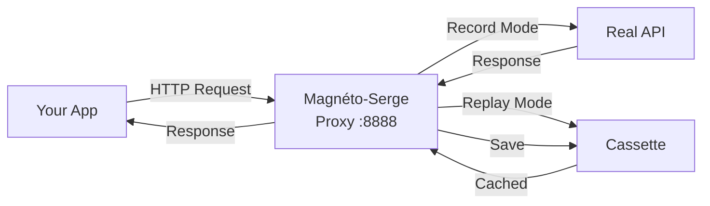
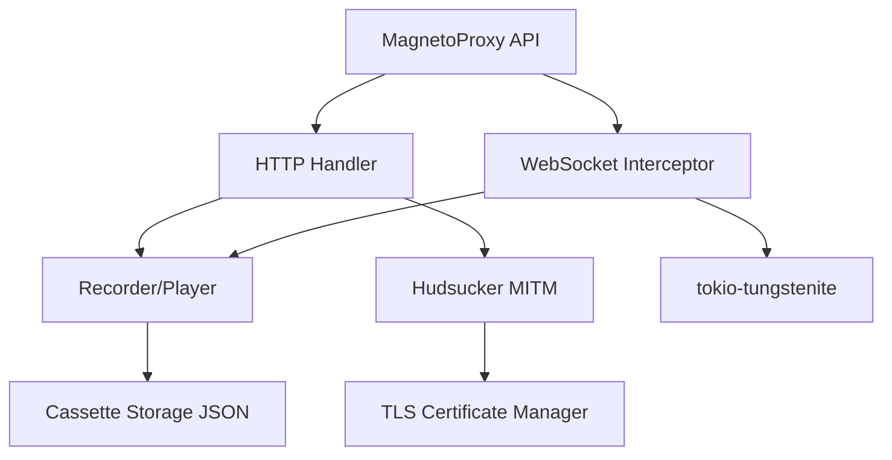

<div align="center">

# ⚡ Magnéto-Serge

**Multi-language HTTP/WebSocket proxy library with record/replay capabilities**

[](https://github.com/taciclei/magneto-serge/actions)
[](https://www.rust-lang.org/)
[](LICENSE)
[](https://crates.io/crates/magneto-serge)

*VCR for the modern web - Record HTTP/HTTPS and WebSocket traffic, replay it deterministically*

[Features](#-features) •
[Installation](#-installation) •
[Quick Start](#-quick-start) •
[Documentation](#-documentation) •
[Examples](#-examples)

</div>

---

## 🎯 Features

<table>
<tr>
<td>

**🔒 HTTP/HTTPS Proxy**
- MITM interception
- Auto TLS certificates
- Request/Response capture

</td>
<td>

**🔌 WebSocket Support**
- Bidirectional messages
- Timing preservation
- Protocol agnostic

</td>
<td>

**🌍 Multi-Language**
- PHP, JavaScript, Java
- Python, Kotlin, Swift
- Universal cassette format

</td>
</tr>
</table>

### Why Magnéto-Serge?

| Feature | Magnéto-Serge | VCR (Ruby) | Polly (JS) |
|---------|---------------|------------|------------|
| **Multi-language** | ✅ 6+ languages | ❌ Ruby only | ❌ JS only |
| **WebSocket** | ✅ Full support | ❌ No | ⚠️ Limited |
| **Performance** | ⚡ Rust-powered | 🐌 Ruby | 🐌 JS |
| **HTTPS MITM** | ✅ Auto certs | ⚠️ Manual | ⚠️ Manual |
| **Zero config** | ✅ Auto mode | ❌ | ❌ |

---

## 📦 Installation

### 🐘 PHP (Composer)

```bash
composer require magneto/serge
```

```php
<?php
require 'vendor/autoload.php';
use Magneto\Serge\MagnetoProxy;
use Magneto\Serge\ProxyMode;
```

### 🟨 JavaScript/TypeScript (npm)

```bash
npm install @magneto/serge
```

```javascript
const { MagnetoProxy, ProxyMode } = require('@magneto/serge');
```

### ☕ Java (Maven)

```xml
<dependency>
  <groupId>io.github.magneto</groupId>
  <artifactId>serge</artifactId>
  <version>0.1.0</version>
</dependency>
```

### 🐍 Python (PyPI)

```bash
pip install magneto-serge
```

### 🦀 Rust (Cargo)

```toml
[dependencies]
magneto-serge = "0.1"
```

### 🟣 Kotlin & 🍎 Swift

See [BINDINGS.md](BINDINGS.md) for complete installation instructions.

---

## 🚀 Quick Start

### Record & Replay in 3 Lines

```rust
use magneto_serge::{MagnetoProxy, ProxyMode};

fn main() -> Result<(), Box<dyn std::error::Error>> {
    // Create proxy with auto mode (record if missing, else replay)
    let mut proxy = MagnetoProxy::new_internal("./cassettes")?
        .with_port(8888)
        .with_mode(ProxyMode::Auto);

    // Start recording
    proxy.start_recording_internal("my-api-test".to_string())?;

    // Configure your HTTP client to use proxy localhost:8888
    // Make your requests...

    // Stop and save
    proxy.stop_recording_internal()?;
    proxy.shutdown_internal()?;

    Ok(())
}
```

### How It Works



**3 Modes:**
- 🔴 **Record**: Proxy → Real API → Save to cassette
- ▶️ **Replay**: Proxy → Load from cassette → Return cached
- 🟢 **Auto**: Record if cassette missing, replay if exists

---

## 💡 Examples

<details>
<summary><b>🐘 PHP with PHPUnit</b></summary>

```php
<?php
use Magneto\Serge\MagnetoProxy;
use Magneto\Serge\ProxyMode;

class ApiTest extends \PHPUnit\Framework\TestCase {
    public function testApiWithMagneto() {
        $proxy = new MagnetoProxy("./cassettes");
        $proxy->setMode(ProxyMode::AUTO);
        $proxy->startRecording("github-api-test");

        // First run: records
        // Second run: replays from cassette
        $client = new \GuzzleHttp\Client([
            'proxy' => 'http://localhost:8888'
        ]);

        $response = $client->get('https://api.github.com/users/octocat');

        $this->assertEquals(200, $response->getStatusCode());
        $proxy->stopRecording();
    }
}
```

</details>

<details>
<summary><b>🟨 JavaScript with Jest</b></summary>

```javascript
const { MagnetoProxy, ProxyMode } = require('@magneto/serge');

test('API with Magneto', async () => {
  const proxy = new MagnetoProxy('./cassettes');
  proxy.setMode(ProxyMode.Auto);
  proxy.startRecording('github-api-test');

  const response = await fetch('https://api.github.com/users/octocat', {
    agent: new HttpsProxyAgent('http://localhost:8888')
  });

  expect(response.status).toBe(200);
  proxy.stopRecording();
});
```

</details>

<details>
<summary><b>☕ Java with JUnit 5</b></summary>

```java
@Test
public void testApiWithMagneto() {
    MagnetoProxy proxy = new MagnetoProxy("./cassettes");
    proxy.setMode(ProxyMode.AUTO);
    proxy.startRecording("github-api-test");

    // Configure HTTP client with proxy localhost:8888
    HttpResponse<String> response = client.send(request);

    assertEquals(200, response.statusCode());
    proxy.stopRecording();
}
```

</details>

<details>
<summary><b>🐍 Python with pytest</b></summary>

```python
from magneto_serge import MagnetoProxy, ProxyMode
import requests

def test_api_with_magneto():
    proxy = MagnetoProxy(cassette_dir="./cassettes")
    proxy.set_mode(ProxyMode.Auto)
    proxy.start_recording("github-api-test")

    # First run: records
    # Second run: replays from cassette
    response = requests.get(
        "https://api.github.com/users/octocat",
        proxies={"https": "http://localhost:8888"}
    )

    assert response.status_code == 200
    proxy.stop_recording()
```

</details>

---

## 📋 Cassette Format

Cassettes are **language-agnostic JSON** files - record in Rust, replay in Python!

```json
{
  "version": "1.0",
  "name": "my-api-test",
  "recorded_at": "2025-10-10T14:30:00Z",
  "interactions": [
    {
      "type": "Http",
      "request": {
        "method": "GET",
        "url": "https://api.example.com/users",
        "headers": {"accept": "application/json"},
        "body": null
      },
      "response": {
        "status": 200,
        "headers": {"content-type": "application/json"},
        "body": [...]
      }
    },
    {
      "type": "WebSocket",
      "url": "wss://stream.example.com",
      "messages": [
        {"direction": "Sent", "timestamp_ms": 0, "data": "..."},
        {"direction": "Received", "timestamp_ms": 120, "data": "..."}
      ]
    }
  ]
}
```

**Format features:**
- ✅ JSON or MessagePack
- ✅ Share across languages
- ✅ Version controlled
- ✅ Human readable

---

## 🏗️ Architecture



**Core components:**
- 🎯 **MagnetoProxy**: Public API (Rust + UniFFI)
- 🔄 **HTTP Handler**: MITM proxy with Hudsucker
- 🔌 **WebSocket Interceptor**: Bidirectional message capture
- 💾 **Recorder/Player**: Cassette serialization & matching
- 🔐 **TLS Manager**: Auto-generated certificates

---

## 🎯 Use Cases

### 🧪 **Testing**
```rust
// Record real API once, replay thousands of times
// ✅ No network flakiness
// ✅ Instant test execution
// ✅ Offline development
```

### 🐛 **Debugging**
```rust
// Capture production traffic
// Replay locally for investigation
// Inspect every request/response
```

### 📊 **Development**
```rust
// Mock external APIs
// Work offline with cached responses
// Consistent test fixtures
```

---

## 🛠️ Development

```bash
# Clone
git clone https://github.com/taciclei/magneto-serge.git
cd magneto-serge

# Build
cargo build --release

# Test
cargo test --all-features

# Lint
cargo clippy --all-features -- -D warnings

# Format
cargo fmt --all

# Generate bindings
cargo run --bin generate-bindings
```

### Project Structure

```
magneto-serge/
├── src/
│   ├── lib.rs              # Core library
│   ├── proxy.rs            # MagnetoProxy implementation
│   ├── cassette.rs         # Cassette format
│   ├── player.rs           # Replay engine
│   ├── recorder.rs         # Record engine
│   ├── websocket/          # WebSocket support
│   └── magneto_serge.udl   # UniFFI definitions
├── examples/               # Rust examples
├── bindings/               # Multi-language bindings
│   ├── python/
│   ├── java/
│   ├── javascript/
│   ├── kotlin/
│   └── swift/
└── tests/                  # Integration tests
```

---

## 📚 Documentation

| Documentation | Description |
|---------------|-------------|
| [**BINDINGS.md**](BINDINGS.md) | 🌐 Complete multi-language guide |
| [**PHP README**](bindings/php/README.md) | 🐘 PHP-specific docs |
| [**JavaScript README**](bindings/javascript/README.md) | 🟨 JS/TS-specific docs |
| [**Java README**](bindings/java/README.md) | ☕ Java-specific docs |
| [**Python README**](bindings/python/README.md) | 🐍 Python-specific docs |
| [**ROADMAP.md**](ROADMAP.md) | 🗺️ Development roadmap |
| [**CLAUDE.md**](CLAUDE.md) | 🤖 AI assistant instructions |

---

## 🎯 Roadmap

| Phase | Status | Progress |
|-------|--------|----------|
| **Phase 1** - HTTP/HTTPS Proxy | ✅ Complete | 100% |
| **Phase 2** - WebSocket Support | ✅ Complete | 100% |
| **Phase 3** - Multi-language Bindings | 🟡 In Progress | 85% |
| **Phase 4** - CLI & Production | ⏳ Pending | 0% |

**Next milestones:**
- [ ] Publish to crates.io, PyPI, NPM, Maven
- [ ] CLI tool with `magneto` command
- [ ] Performance benchmarks
- [ ] 1.0 stable release

See [ROADMAP.md](ROADMAP.md) for details.

---

## 🤝 Contributing

We welcome contributions! Here's how:

1. 🍴 Fork the repository
2. 🔧 Create a feature branch (`git checkout -b feature/amazing`)
3. ✅ Add tests for your changes
4. 🎨 Run `cargo fmt` and `cargo clippy`
5. 📝 Commit (`git commit -m 'Add amazing feature'`)
6. 🚀 Push (`git push origin feature/amazing`)
7. 🎉 Open a Pull Request

**Development requirements:**
- Rust 1.75+
- Cargo
- (Optional) Python, Node.js, Java for bindings

---

## 📄 License

Licensed under either of:

- **Apache License, Version 2.0** ([LICENSE-APACHE](LICENSE-APACHE) or http://www.apache.org/licenses/LICENSE-2.0)
- **MIT license** ([LICENSE-MIT](LICENSE-MIT) or http://opensource.org/licenses/MIT)

at your option.

### Contribution

Unless you explicitly state otherwise, any contribution intentionally submitted for inclusion in the work by you, as defined in the Apache-2.0 license, shall be dual licensed as above, without any additional terms or conditions.

---

## 🌟 Acknowledgments

**Inspired by:**
- [VCR](https://github.com/vcr/vcr) - Ruby HTTP recording library
- [Polly.JS](https://github.com/Netflix/pollyjs) - JavaScript HTTP mocking
- [Betamax](https://github.com/betamaxpy/betamax) - Python VCR port

**Built with:**
- [Hudsucker](https://github.com/omjadas/hudsucker) - HTTP/HTTPS MITM proxy
- [UniFFI](https://github.com/mozilla/uniffi-rs) - Multi-language FFI bindings
- [Tokio](https://tokio.rs/) - Async runtime
- [rcgen](https://github.com/est31/rcgen) - TLS certificate generation
- [serde](https://serde.rs/) - Serialization framework

---

<div align="center">

**⚡ Made with Rust for maximum performance and safety**

[⭐ Star on GitHub](https://github.com/taciclei/magneto-serge) • [📝 Report Bug](https://github.com/taciclei/magneto-serge/issues) • [💡 Request Feature](https://github.com/taciclei/magneto-serge/issues)

</div>
