<div align="center">

# ⚡ Magnéto-Serge

**Multi-language HTTP/WebSocket proxy library with record/replay capabilities**

[](https://github.com/taciclei/magneto-serge/actions)
[](https://www.rust-lang.org/)
[](LICENSE)
[](#-development)
[](https://github.com/taciclei/magneto-serge/issues)

*VCR for the modern web - Record HTTP/HTTPS and WebSocket traffic, replay it deterministically*

[Features](#-features) •
[Installation](#-installation) •
[Quick Start](#-quick-start) •
[Documentation](#-documentation) •
[Examples](#-examples)

</div>

---

## 🎯 Features

<table>
<tr>
<td>

**🔒 HTTP/HTTPS Proxy**
- MITM interception
- Auto TLS certificates
- Request/Response capture

</td>
<td>

**🔌 WebSocket Support**
- Bidirectional messages
- Timing preservation
- Protocol agnostic

</td>
<td>

**🌍 Multi-Language**
- JavaScript, Rust
- Python, Kotlin, Swift (planned)
- Universal cassette format

</td>
</tr>
</table>

### Why Magnéto-Serge?

| Feature | Magnéto-Serge | VCR (Ruby) | Polly (JS) |
|---------|---------------|------------|------------|
| **Multi-language** | ✅ Rust + JS ready | ❌ Ruby only | ❌ JS only |
| **WebSocket** | ✅ Full support | ❌ No | ⚠️ Limited |
| **Performance** | ⚡ Rust-powered | 🐌 Ruby | 🐌 JS |
| **HTTPS MITM** | ✅ Auto certs | ⚠️ Manual | ⚠️ Manual |
| **Zero config** | ✅ Auto mode | ❌ | ❌ |

---

## 📦 Installation

### 🍺 Homebrew (macOS/Linux) - Recommended

```bash
# Add the tap
brew tap taciclei/tap https://github.com/taciclei/magneto-serge

# Install
brew install magneto-serge

# Verify
magneto --version
```

### 🚀 One-Line Installer (curl)

```bash
curl -sSL https://raw.githubusercontent.com/taciclei/magneto-serge/main/install.sh | bash
```

### 📥 Pre-built Binaries

Download from [GitHub Releases](https://github.com/taciclei/magneto-serge/releases):

- **macOS**: `magneto-macos-amd64.tar.gz` (Intel) or `magneto-macos-arm64.tar.gz` (Apple Silicon)
- **Linux**: `magneto-linux-amd64.tar.gz` or `magneto-linux-arm64.tar.gz`
- **Windows**: `magneto-windows-amd64.exe.zip`

```bash
# Example for macOS ARM64
curl -LO https://github.com/taciclei/magneto-serge/releases/latest/download/magneto-macos-arm64.tar.gz
tar xzf magneto-macos-arm64.tar.gz
chmod +x magneto
mv magneto /usr/local/bin/
```

### 🦀 Rust (Cargo)

```toml
[dependencies]
magneto-serge = "0.2.0"
```

Or install the CLI:

```bash
cargo install magneto-serge --features cli
```

### 🟨 JavaScript/TypeScript (npm)

```bash
# Via npm (GitHub Packages)
npm install @taciclei/magneto-serge
```

```javascript
const { MagnetoProxy, ProxyMode } = require('@taciclei/magneto-serge');
```

### 🐍 Python, ☕ Java, 🟣 Kotlin, 🍎 Swift (Coming Soon)

Multi-language bindings are in development. See [ROADMAP.md](docs/ROADMAP.md) for status.

---

## 🚀 Quick Start

### ⚡ Automated Setup (Makefile)

The fastest way to get started with the complete ecosystem:

```bash
# Check dependencies
make help           # Show all available commands
./scripts/check-deps.sh  # Verify dependencies

# Quick setup (install + build)
make quick          # Install deps + build Rust

# Install everything (Rust + Node.js backends + Angular clients)
make install        # Install all dependencies
make build-all      # Build everything

# Start complete stack (API + Backend + Frontend)
make dev            # Launch in tmux (automatic)
make dev-manual     # Get manual instructions

# Individual services
make run-api               # Start Magneto API (port 8889)
make run-backend           # Start Node.js backend (port 3000)
make run-client-simple     # Start Angular client (port 4201)
make run-client-hydra      # Start Angular Hydra demo (port 4200)

# CLI examples
make example-record  # Record HTTP requests
make example-replay  # Replay from cassette
make example-auto    # Auto mode (smart)

# Utilities
make status         # Check running services
make ports          # Show used ports
make clean-all      # Clean everything
```

**Complete Makefile reference**: Run `make help` for all 50+ commands.

### Basic Usage (Rust)

```rust
use magneto_serge::{MagnetoProxy, ProxyMode};

fn main() -> Result<(), Box<dyn std::error::Error>> {
    // Create proxy with auto mode (record if missing, else replay)
    let proxy = MagnetoProxy::new_internal("./cassettes")?
        .with_port(8888)
        .with_mode(ProxyMode::Auto);

    // Start recording
    proxy.start_recording_internal("my-api-test".to_string())?;

    // Configure your HTTP client to use proxy localhost:8888
    // Make your API requests here...

    // Stop and save cassette
    proxy.stop_recording_internal()?;
    proxy.shutdown_internal()?;

    Ok(())
}
```

### JavaScript Example

```javascript
const { MagnetoProxy, ProxyMode } = require('@taciclei/magneto-serge');

// Create proxy instance
const proxy = new MagnetoProxy('./cassettes');
proxy.setPort(8888);
proxy.setMode(ProxyMode.Auto);

// Start recording
proxy.startRecording('my-api-test');

// Configure your HTTP client to proxy through localhost:8888
// Make your API requests...

// Stop recording
proxy.stopRecording();
proxy.shutdown();
```

### How It Works

```mermaid
graph LR
    A[Your App] -->|HTTP Request| B[Magnéto-Serge<br/>Proxy :8888]
    B -->|Record Mode| C[Real API]
    B -->|Replay Mode| D[Cassette]
    C -->|Response| B
    D -->|Cached| B
    B -->|Response| A
    B -->|Save| D
```



**3 Modes:**
- 🔴 **Record**: Proxy → Real API → Save to cassette
- ▶️ **Replay**: Proxy → Load from cassette → Return cached
- 🟢 **Auto**: Record if cassette missing, replay if exists

---

## 💡 Examples

<details>
<summary><b>🟨 JavaScript with Express Server</b></summary>

```javascript
const { MagnetoProxy, ProxyMode } = require('@taciclei/magneto-serge');
const axios = require('axios');

async function testWithMagneto() {
  const proxy = new MagnetoProxy('./cassettes');
  proxy.setPort(8888);
  proxy.setMode(ProxyMode.Auto);
  proxy.startRecording('github-api-test');

  // Configure axios to use proxy
  const client = axios.create({
    proxy: {
      host: 'localhost',
      port: 8888
    }
  });

  try {
    // First run: records from real API
    // Second run: replays from cassette
    const response = await client.get('https://api.github.com/users/octocat');
    console.log('User:', response.data.login);
  } finally {
    proxy.stopRecording();
    proxy.shutdown();
  }
}

testWithMagneto();
```

</details>

<details>
<summary><b>🦀 Rust with reqwest</b></summary>

```rust
use magneto_serge::{MagnetoProxy, ProxyMode};

#[tokio::main]
async fn main() -> Result<(), Box<dyn std::error::Error>> {
    let proxy = MagnetoProxy::new_internal("./cassettes")?
        .with_port(8888)
        .with_mode(ProxyMode::Auto);

    proxy.start_recording_internal("github-api-test".to_string())?;

    // Configure reqwest to use proxy
    let client = reqwest::Client::builder()
        .proxy(reqwest::Proxy::all("http://localhost:8888")?)
        .build()?;

    let response = client
        .get("https://api.github.com/users/octocat")
        .send()
        .await?;

    println!("Status: {}", response.status());

    proxy.stop_recording_internal()?;
    proxy.shutdown_internal()?;

    Ok(())
}
```

</details>

<details>
<summary><b>🧪 Integration Testing Pattern</b></summary>

```rust
#[cfg(test)]
mod tests {
    use magneto_serge::{MagnetoProxy, ProxyMode};

    #[test]
    fn test_api_integration() {
        let proxy = MagnetoProxy::new_internal("./test-cassettes")
            .expect("Failed to create proxy")
            .with_port(9999)
            .with_mode(ProxyMode::Auto);

        proxy.start_recording_internal("integration-test".to_string())
            .expect("Failed to start recording");

        // Your test code here
        // Configure HTTP client to use localhost:9999

        proxy.stop_recording_internal()
            .expect("Failed to stop recording");
    }
}
```

</details>

---

## 🌐 REST API

Magneto-Serge provides a **complete REST API with Hydra/JSON-LD** and **OpenAPI 3.0** support for remote proxy control.

### Starting the API Server

```bash
# Start the API server
magneto api

# With authentication
magneto api --auth --api-key your-secret-key

# Custom host/port
magneto api --host 0.0.0.0 --port 8889
```

### Key Features

- ✅ **Hypermedia (HATEOAS)**: Self-documenting with Hydra/JSON-LD links
- ✅ **OpenAPI 3.0**: Complete specification at `/openapi.json`
- ✅ **Authentication**: Bearer token support
- ✅ **CORS**: Cross-origin requests enabled
- ✅ **Language-agnostic**: Use from any HTTP client

### Quick Example

```bash
# Start proxy via API
curl -X POST http://localhost:8889/proxy/start \
  -H "Content-Type: application/json" \
  -d '{
    "mode": "auto",
    "cassette_name": "my-test",
    "port": 8888
  }'

# Check status
curl http://localhost:8889/proxy/status

# Stop proxy
curl -X POST http://localhost:8889/proxy/stop
```

### Available Endpoints

| Method | Endpoint | Description |
|--------|----------|-------------|
| `GET` | `/` | API root with Hydra links |
| `GET` | `/openapi.json` | OpenAPI 3.0 specification |
| `GET` | `/health` | Health check |
| `POST` | `/proxy/start` | Start proxy (auto/record/replay/passthrough) |
| `POST` | `/proxy/stop` | Stop proxy |
| `GET` | `/proxy/status` | Get proxy status |
| `GET` | `/proxy/stats` | Get statistics |
| `GET` | `/cassettes` | List all cassettes |
| `GET` | `/cassettes/{name}` | Get cassette content |
| `DELETE` | `/cassettes/{name}` | Delete cassette |

### Client Examples

<details>
<summary><b>🐍 Python</b></summary>

```python
import requests

api = "http://localhost:8889"

# Start proxy
response = requests.post(f"{api}/proxy/start", json={
    "mode": "auto",
    "cassette_name": "test",
    "port": 8888
})

# Get status
status = requests.get(f"{api}/proxy/status").json()
print(f"Running: {status['data']['running']}")

# Follow Hydra links
links = status.get('hydra:link', [])
for link in links:
    print(f"→ {link['title']}: {link['hydra:target']}")
```

</details>

<details>
<summary><b>🟨 JavaScript/Node.js</b></summary>

```javascript
const fetch = require('node-fetch');

const api = 'http://localhost:8889';

// Start proxy
await fetch(`${api}/proxy/start`, {
  method: 'POST',
  headers: { 'Content-Type': 'application/json' },
  body: JSON.stringify({
    mode: 'auto',
    cassette_name: 'test',
    port: 8888
  })
});

// Get status with authentication
const status = await fetch(`${api}/proxy/status`, {
  headers: { 'Authorization': 'Bearer your-key' }
}).then(r => r.json());

console.log('Running:', status.data.running);
```

</details>

<details>
<summary><b>💻 Bash/curl</b></summary>

```bash
#!/bin/bash
API="http://localhost:8889"

# List cassettes
curl $API/cassettes | jq '.data[].name'

# Start proxy with authentication
curl -X POST $API/proxy/start \
  -H "Authorization: Bearer your-key" \
  -H "Content-Type: application/json" \
  -d '{"mode": "record", "cassette_name": "test"}'

# Get OpenAPI spec
curl $API/openapi.json | jq '.info'
```

</details>

### Hypermedia Navigation

Every API response includes **Hydra links** for discoverability:

```json
{
  "@context": "https://www.w3.org/ns/hydra/core",
  "@type": "hydra:Resource",
  "success": true,
  "data": { "message": "Proxy started successfully" },
  "hydra:link": [
    {
      "@type": "hydra:Link",
      "hydra:target": "http://localhost:8889/proxy/status",
      "title": "Check Proxy Status",
      "hydra:operation": [{
        "@type": "http://schema.org/ViewAction",
        "method": "GET"
      }]
    }
  ]
}
```

Clients can **discover and navigate** the API dynamically without hardcoding URLs!

### Full API Documentation

See **[docs/API.md](docs/API.md)** for complete reference including:
- Authentication setup
- Request/response schemas
- Error handling
- Integration examples (CI/CD, Docker, Kubernetes)
- Swagger UI setup

---

## 🌐 Web Ecosystem

Magneto-Serge includes a **complete web stack** with multiple frontend/backend architectures.

### Architecture Options

<table>
<tr>
<td width="33%">

**1. CLI Only** ⚡
```bash
magneto record test
magneto replay test
```
→ Perfect for scripts, CI/CD

</td>
<td width="33%">

**2. Production Stack** 🏭
```
Angular Client
    ↓
Node.js Backend
    ↓
Magneto API
```
→ Recommended for production

</td>
<td width="33%">

**3. Hydra Demo** 🔬
```
Angular + Alcaeus
    ↓
Magneto API
```
→ Hypermedia demonstration

</td>
</tr>
</table>

### Quick Start: Complete Stack

```bash
# Automatic (with tmux)
make dev

# Or manual (3 terminals)
make dev-manual
```

**Opens:**
- **API**: http://localhost:8889 (Rust/Axum)
- **Backend**: http://localhost:3000 (Node.js/Express)
- **Client**: http://localhost:4201 (Angular)

### Components

#### 1. Backend Node.js (Recommended)
**Location**: `examples/nodejs-backend/`

Alcaeus wrapper exposing simplified REST API:

```bash
cd examples/nodejs-backend
npm install
npm start
# → http://localhost:3000
```

**Features**:
- ✅ Alcaeus native (Node.js, zero polyfill)
- ✅ Server-side cache (shared across clients)
- ✅ JSON-LD → JSON simplification
- ✅ Production-ready architecture

**Docs**: [nodejs-backend/README.md](examples/nodejs-backend/README.md) | [ARCHITECTURE.md](examples/nodejs-backend/ARCHITECTURE.md)

#### 2. Angular Simple Client (Production)
**Location**: `examples/angular-simple-client/`

Production Angular client using the Node.js backend:

```bash
cd examples/angular-simple-client
npm install
npm start
# → http://localhost:4201
```

**Features**:
- ✅ Native HttpClient (no Alcaeus/RDF)
- ✅ Simple TypeScript types
- ✅ Lightweight build (~50kb)
- ✅ Full proxy control dashboard

**Docs**: [angular-simple-client/README.md](examples/angular-simple-client/README.md)

#### 3. Angular Hydra Client (Demo)
**Location**: `examples/angular-client/`

Demonstration of Hydra/JSON-LD navigation with Alcaeus in browser:

```bash
cd examples/angular-client
npm install
npm start
# → http://localhost:4200
```

**Features**:
- ✅ Alcaeus integration in browser
- ✅ Automatic Hydra navigation (zero hardcoded URLs)
- ✅ JSON-LD parsing
- ⚠️ Requires Node.js polyfills (+100kb)

**Docs**: [angular-client/README.md](examples/angular-client/README.md)

### Architecture Comparison

| Aspect | CLI | Simple Client + Backend | Hydra Client Direct |
|--------|-----|------------------------|---------------------|
| **Use Case** | Scripts, CI/CD | Production web app | Hydra demo |
| **Complexity** | ✅ Simple | ✅ Medium | ⚠️ Complex |
| **Build Size** | N/A | ✅ ~50kb | ⚠️ ~150kb |
| **Dependencies** | Rust only | Node + Angular | Alcaeus + RDF + Polyfills |
| **Performance** | ✅ Maximum | ✅ Server cache | ⚠️ Client parsing |
| **Production** | ✅ Yes | ✅ **Recommended** | ⚠️ Demo only |

### Complete Guides

- **[QUICK_START.md](QUICK_START.md)**: Comprehensive startup guide with 5 use cases
- **[examples/README.md](examples/README.md)**: All examples catalog
- **[examples/nodejs-backend/ARCHITECTURE.md](examples/nodejs-backend/ARCHITECTURE.md)**: 3-tier production architecture

---

## 📋 Cassette Format

Cassettes are **language-agnostic JSON** files - record in Rust, replay in JavaScript!

```json
{
  "version": "1.0",
  "name": "my-api-test",
  "recorded_at": "2025-10-10T14:30:00Z",
  "interactions": [
    {
      "type": "Http",
      "request": {
        "method": "GET",
        "url": "https://api.example.com/users",
        "headers": {"accept": "application/json"},
        "body": null
      },
      "response": {
        "status": 200,
        "headers": {"content-type": "application/json"},
        "body": [...]
      }
    },
    {
      "type": "WebSocket",
      "url": "wss://stream.example.com",
      "messages": [
        {"direction": "Sent", "timestamp_ms": 0, "msg_type": "Text", "data": "..."},
        {"direction": "Received", "timestamp_ms": 120, "msg_type": "Text", "data": "..."}
      ]
    }
  ]
}
```

**Format features:**
- ✅ JSON or MessagePack (with `msgpack` feature)
- ✅ Share across languages
- ✅ Version controlled (git-friendly)
- ✅ Human readable

---

## 🏗️ Architecture


**Core components:**
- 🎯 **MagnetoProxy**: Public API (Rust + NAPI-RS for JS)
- 🔄 **HTTP Handler**: MITM proxy with Hudsucker
- 🔌 **WebSocket Interceptor**: Bidirectional message capture
- 💾 **Recorder/Player**: Cassette serialization & matching
- 🔐 **TLS Manager**: Auto-generated certificates

---

## 🎯 Use Cases

### 🧪 **Testing**
```rust
// Record real API once, replay thousands of times
// ✅ No network flakiness
// ✅ Instant test execution (no API calls)
// ✅ Offline development
// ✅ Deterministic tests in CI/CD
```

### 🐛 **Debugging**
```rust
// Capture production traffic
// Replay locally for investigation
// Inspect every request/response
```

### 📊 **Development**
```rust
// Mock external APIs during development
// Work offline with cached responses
// Consistent test fixtures across team
```

---

## 🛠️ Development

### Using Makefile (Recommended)

```bash
# Clone repository
git clone https://github.com/taciclei/magneto-serge.git
cd magneto-serge

# Check dependencies
./scripts/check-deps.sh

# Quick setup
make quick          # Install + build in one command

# Or step by step
make install        # Install all dependencies
make build-all      # Build everything
make test           # Run all tests

# Development workflow
make dev            # Start complete stack (tmux)
make status         # Check services status
make clean-all      # Clean everything

# CI/CD checks
make ci             # Run fmt, clippy, tests

# See all commands
make help
```

### Manual Commands

```bash
# Build Rust library
cargo build --release

# Run all tests (68 tests)
cargo test --all-features

# Run integration tests
cargo test --test integration_test

# Lint
cargo clippy --all-features -- -D warnings

# Format
cargo fmt --all

# Build JavaScript bindings
cd bindings/javascript
npm install
npm run build

# Build Angular clients
cd examples/angular-simple-client && npm install && npm run build
cd examples/angular-client && npm install && npm run build

# Build Node.js backend
cd examples/nodejs-backend && npm install
```

### Running Tests

```bash
# Rust unit tests (47 tests)
cargo test --lib

# Integration tests (9 tests)
cargo test --test integration_test

# WebSocket tests (5 tests)
cargo test --test websocket_integration

# JavaScript tests
cd bindings/javascript
node test-complete.js
```

**Current Test Status: 68/68 passing ✅**
- 33 Rust unit tests
- 9 Rust integration tests
- 5 WebSocket integration tests
- 10+ JavaScript API tests
- 7+ JavaScript HTTP tests

### Project Structure

```
magneto-serge/
├── src/
│   ├── lib.rs              # Core library
│   ├── proxy.rs            # MagnetoProxy implementation
│   ├── cassette.rs         # Cassette format
│   ├── player.rs           # Replay engine
│   ├── recorder.rs         # Record engine
│   ├── websocket/          # WebSocket support
│   ├── tls/                # TLS certificate management
│   └── error.rs            # Error types
├── bindings/
│   └── javascript/         # NAPI-RS bindings for Node.js
│       ├── src/lib.rs
│       ├── package.json
│       └── index.js
├── tests/                  # Integration tests
│   ├── integration_test.rs
│   └── websocket_integration.rs
├── examples/               # Usage examples
└── docs/                   # Documentation
    ├── ROADMAP.md
    └── ARCHITECTURE.md
```

---

## 📚 Documentation

| Documentation | Description |
|---------------|-------------|
| [**QUICK_START.md**](QUICK_START.md) | 🚀 Quick start guide with use cases |
| [**Makefile**](Makefile) | ⚡ 50+ automation commands |
| [**ROADMAP.md**](docs/ROADMAP.md) | 🗺️ Development roadmap & progress |
| [**ARCHITECTURE.md**](docs/ARCHITECTURE.md) | 🏗️ Technical architecture details |
| [**API.md**](docs/API.md) | 🌐 Complete REST API reference |
| [**TECH-STACK.md**](docs/TECH-STACK.md) | 📚 Complete dependency list |
| [**SECRETS_SETUP.md**](docs/SECRETS_SETUP.md) | 🔐 GitHub secrets setup for CD |
| [**CLAUDE.md**](CLAUDE.md) | 🤖 AI assistant instructions |

**Web Ecosystem:**
| Documentation | Description |
|---------------|-------------|
| [**nodejs-backend/README.md**](examples/nodejs-backend/README.md) | 🟢 Node.js backend guide |
| [**nodejs-backend/ARCHITECTURE.md**](examples/nodejs-backend/ARCHITECTURE.md) | 🏗️ Production architecture (3-tier) |
| [**angular-simple-client/README.md**](examples/angular-simple-client/README.md) | 🅰️ Production Angular client |
| [**angular-client/README.md**](examples/angular-client/README.md) | 🅰️ Hydra demo client |
| [**examples/README.md**](examples/README.md) | 📚 All examples catalog |

**Bindings:**
| Documentation | Description |
|---------------|-------------|
| [**JavaScript README**](bindings/javascript/README.md) | 🟨 JS/TS bindings guide |

---

## 🎯 Roadmap

| Phase | Status | Progress | Details |
|-------|--------|----------|---------|
| **Phase 1** - HTTP/HTTPS Proxy | ✅ Complete | 100% | MITM proxy, record/replay |
| **Phase 2** - WebSocket Support | ✅ Complete | 100% | Bidirectional capture |
| **Phase 3** - Multi-language Bindings | 🟡 In Progress | 50% | Rust ✅, JS ✅, Python/Java pending |
| **Phase 4** - CLI & Production | ⏳ Planned | 0% | CLI tool, benchmarks, 1.0 release |

### Current Status (v0.0.1)

**✅ Completed:**
- Core Rust library with full HTTP/HTTPS support
- WebSocket record/replay
- JavaScript bindings (NAPI-RS)
- 68 tests passing
- CI/CD pipeline functional
- Auto-generated TLS certificates

**🚧 In Progress:**
- Publishing to crates.io (pending email verification)
- Publishing to npm (GitHub Packages)
- TypeScript definitions for JS bindings

**📅 Planned:**
- Python bindings (UniFFI)
- Java/Kotlin bindings
- CLI tool (`magneto` command)
- Performance benchmarks
- Release 1.0

See [ROADMAP.md](docs/ROADMAP.md) for detailed milestones.

---

## 🤝 Contributing

We welcome contributions! **Issues are now enabled** on this repository.

Here's how to contribute:

1. 🍴 Fork the repository
2. 🔧 Create a feature branch (`git checkout -b feature/amazing`)
3. ✅ Add tests for your changes
4. 🎨 Run `cargo fmt` and `cargo clippy`
5. 📝 Commit with descriptive message
6. 🚀 Push to your fork
7. 🎉 Open a Pull Request

**Development requirements:**
- Rust 1.75+ (MSRV)
- Cargo
- (Optional) Node.js 18+ for JavaScript bindings
- (Optional) Python 3.9+ for Python bindings (planned)

**Areas where we need help:**
- 🐍 Python bindings (UniFFI)
- ☕ Java/Kotlin bindings
- 📚 Documentation improvements
- 🧪 More integration tests
- 🎨 Logo design
- 🌐 Translations

---

## 📊 Performance

**Current benchmarks (Rust):**
- HTTP proxy throughput: ~5000 req/s (target met)
- WebSocket message rate: ~10k msg/s (target met)
- Proxy latency: <1ms p50
- Memory footprint: <50 MB

**Test environment:**
- MacBook Pro M1 (ARM64)
- Rust 1.75
- Release build with LTO

> Note: Formal benchmarks coming in Phase 4. Use `cargo bench` for testing.

---

## 🐛 Known Issues

- ⚠️ HTTPS interception requires installing CA certificate in system trust store
- ⚠️ WebSocket replay timing may vary slightly from recording
- ⚠️ Large cassettes (>100MB) may impact performance

See [Issues](https://github.com/taciclei/magneto-serge/issues) for complete list and workarounds.

---

## 📄 License

Licensed under either of:

- **Apache License, Version 2.0** ([LICENSE-APACHE](LICENSE-APACHE) or http://www.apache.org/licenses/LICENSE-2.0)
- **MIT license** ([LICENSE-MIT](LICENSE-MIT) or http://opensource.org/licenses/MIT)

at your option.

### Contribution

Unless you explicitly state otherwise, any contribution intentionally submitted for inclusion in the work by you, as defined in the Apache-2.0 license, shall be dual licensed as above, without any additional terms or conditions.

---

## 🌟 Acknowledgments

**Inspired by:**
- [VCR](https://github.com/vcr/vcr) - Ruby HTTP recording library (original)
- [Polly.JS](https://github.com/Netflix/pollyjs) - JavaScript HTTP mocking
- [Betamax](https://github.com/betamaxpy/betamax) - Python VCR port
- [VHS](https://github.com/joahking/vhs) - Rust VCR attempt (unmaintained, used as starting point)

**Built with:**
- [Hudsucker](https://github.com/omjadas/hudsucker) - HTTP/HTTPS MITM proxy framework
- [NAPI-RS](https://napi.rs/) - Node.js addon framework for Rust
- [Tokio](https://tokio.rs/) - Async runtime for Rust
- [tokio-tungstenite](https://github.com/snapview/tokio-tungstenite) - WebSocket implementation
- [rcgen](https://github.com/est31/rcgen) - TLS certificate generation
- [serde](https://serde.rs/) - Serialization framework

---

## 🔗 Links

- 🏠 **Homepage**: [GitHub Repository](https://github.com/taciclei/magneto-serge)
- 📦 **Crates.io**: Coming soon
- 📦 **npm**: [@taciclei/magneto-serge](https://github.com/taciclei/magneto-serge/packages)
- 📖 **Documentation**: [docs/](docs/)
- 💬 **Issues**: [GitHub Issues](https://github.com/taciclei/magneto-serge/issues)
- 🎬 **Discussions**: [GitHub Discussions](https://github.com/taciclei/magneto-serge/discussions)

---

<div align="center">

**⚡ Made with Rust for maximum performance and safety**

**Current Version: 0.0.1-alpha**

[⭐ Star on GitHub](https://github.com/taciclei/magneto-serge) • [📝 Report Bug](https://github.com/taciclei/magneto-serge/issues) • [💡 Request Feature](https://github.com/taciclei/magneto-serge/issues)

</div>
